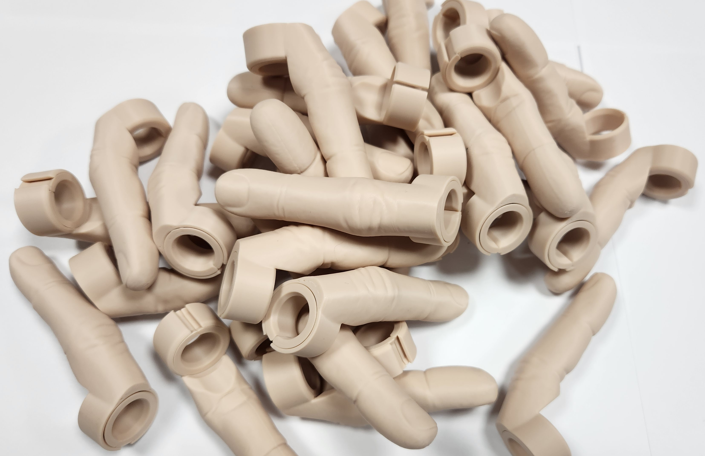

# AI-6th-Finger-Ring
Wear a 6th finger to make surveillance footage look like it's AI generated. From this meme:

There is an insert that can be used for people with small fingers, otherwise just pull it off and discard it.
Printed with SpiderMaker SpiderFlex TPE (Matte TPU) 75A-80A (Fair Skin): https://www.amazon.com/dp/B0BY7ZHDWM

I modified this original design: https://www.thingiverse.com/thing:2034018  
I made pretty minor edits:
* Cut off the base of the finger so it was flush with the ring, so it could be printed vertically with no supports
* Cut off the very top of the finger by a layer or two
* New sized ring with a small slit in the middle
* The ring has beveled internal cones on the top and bottom which make it more comfortable and allows the insert to "snap" into
* The inside base of the finger is concaved, there is a slight cone cut above the insert at the inside base of the finger to avoid needing support
* The insert is a pretty basic ring with slit, and cone shapes on the top and bottom to snap into the larger ring.
* The insert also has internal cones cut out for comfort, and an interal wedge cut at the slit so it is more comfortable.
* Printed with 3 walls and no infill so it remains flexible and a little squishy

I printed the top few dozen layers with a 0.12 layer height which helps with the nail detail and helps the finger come to a ponit.
This "fair skin" filament color is pretty white. You can paint it to better match your skin tone or nails
